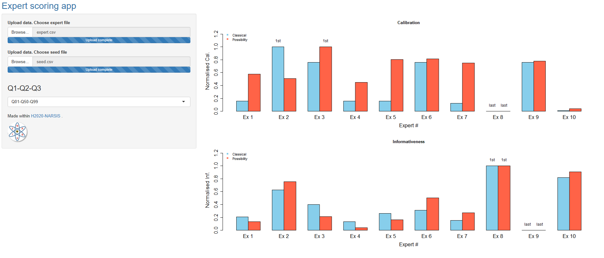

### ExpertScoring
Interactive web app to perfom scoring of experts using the classical [[1]](#1), and the possibilistic [[2]](#2) approach. 

### Prerequisites
Install R package [shiny](https://shiny.rstudio.com/)

### Getting Started
* Run the R script *runApp.R*
* Upload dataset of experts' answers to calibration questions in csv format (e.g. *expert.csv*)
  * *id* column: the index of the expert
  * *var* column: the index of the seed variable
  * *q1* column: the lower percentile (e.g. 5th percentile)
  * *q2* column: the percentile used as best estimate (e.g. the median)
  * *q3* column: the upper percentile (e.g. the 95th percentile)
  * [Example](https://github.com/rohmerj/ExpertScoring/blob/master/data/expert.csv)
* Upload dataset of answers to calibration questions in csv format (e.g. *seed.csv*)
  * *var* column: the index of the seed variable
  * *val* column: the value of the seed variable
  * *l* column: the lower bound
  * *u* column: the upper bound
  * [Example](https://github.com/rohmerj/ExpertScoring/blob/master/data/seed.csv)

### Example

  

### Author
* **Jeremy Rohmer** - [rohmerj](https://orcid.org/0000-0001-9083-5965)

## References
<a id="1">[1]</a> 
Cooke, R. M. (1991). 
Experts in uncertainty. New York: Oxford
University Press.

<a id="2">[2]</a>
Destercke, S., Chojnacki, E. (2008).
Methods for the evaluation and synthesis of multiple sources of information applied to nuclear computer codes.
Nuclear Engineering and Design, 238(9), 2484-2493.

### Acknowledgments
* This study has been carried out within the NARSIS project, which has received funding from the European Union’s H2020-
Euratom Programme under grant agreement N° 755439. 
* We thank [Eric Chojnacki](https://www.researchgate.net/profile/Eric_Chojnacki) for valuable discussions regarding the theorical backgrounds of the implemented methods.
